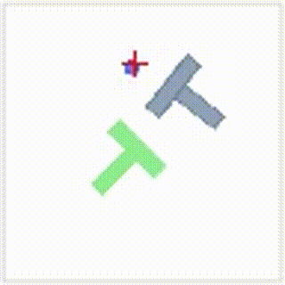

# Diffusion Policy 复现：PushT 视觉运动策略

在 PushT 任务上复现论文 **Diffusion Policy: Visuomotor Policy Learning via Action Diffusion**（Chi et al., RSS 2023）。

本仓库基于官方开源实现 [real-stanford/diffusion_policy](https://github.com/real-stanford/diffusion_policy) 运行，**策略代码为官方实现，非从零复现**。目标是在本地 CUDA 环境上跑通官方训练与评估流程。

## 结果

**任务**：PushT（把 T 形块推到目标区域），image 输入版本。

| 项目 | 本仓库 | 官方（`diffusion_policy_cnn`） |
|---|---|---|
| 训练轮数 | 800 epoch | 3000 epoch |
| 随机种子数 | **1**（`training.seed=42`） | 3（聚合） |
| **`test/mean_score`（最佳）** | **0.8996**（epoch 650） | `max` **0.9066** / `k_min_train_loss` **0.8387** |
| 95% 置信区间（n=50） | **[0.8372, 0.9619]** | 官方未报 |
| **成功率**（coverage > 95%） | **31/50 = 62%** | 官方未报 |
| 训练用时 | 14 小时 4 分（单卡 RTX 5060 Laptop） | — |
| 硬件 | RTX 5060 Laptop (8GB), CUDA 12.8, PyTorch 2.8.0 | — |

### 学习曲线

每 50 轮评估一次，每次 50 个测试 episode（官方 `n_test=50` 协议，种子固定 100000~100049）。
下表为训练全程的 **16 次评估**，可在 `metrics/eval_history.jsonl` 中逐条核对。

| epoch | `test/mean_score` | train_loss |
|---:|---:|---:|
| 0 | 0.1291 | 0.3948 |
| 50 | 0.6963 | 0.0298 |
| 100 | 0.8196 | 0.0212 |
| 150 | 0.8112 | 0.0155 |
| 200 | 0.8007 | 0.0134 |
| 250 | 0.8695 | 0.0116 |
| 300 | 0.8402 | 0.0099 |
| 350 | 0.8664 | 0.0085 |
| 400 | 0.8452 | 0.0070 |
| 450 | 0.8389 | 0.0063 |
| 500 | 0.8516 | 0.0050 |
| 550 | 0.8879 | 0.0037 |
| 600 | 0.8495 | 0.0033 |
| **650** | **0.8996** ← 最佳 | 0.0025 |
| 700 | 0.8946 | 0.0018 |
| 750 | 0.8596 | 0.0018 |

**几点观察**：

- 收敛很快：第 100 轮已到 0.82，之后是缓慢爬升
- 100~600 轮之间在 0.80~0.89 区间波动，**单次评估的抖动（±0.05）大于真实提升**
- 最佳出现在 epoch 650，但 epoch 700 只有微弱下降、750 明显回落，说明**该配置在此任务上已接近上限**
- `train_loss` 持续单调下降（0.395 → 0.0018），但 `mean_score` 不再提升 —— 典型的**过拟合（overfitting）**迹象：模型把训练数据背得更熟了，泛化能力没有跟着涨

### 这个结果能说明什么，不能说明什么

✅ **可以说的**

- 单种子（seed 42）结果 0.8996，其 95% 置信区间 [0.8372, 0.9619] **覆盖**官方 3 种子聚合的 `max` 值 0.9066
- 因此本复现与官方结果**在统计上无显著差异**，训练流程与评估流程均已跑通

❌ **不能说的**

- ❌「超过官方」——单种子无法估计训练方差，两者统计口径不同（详见下节）
- ❌「达到官方水平」——需要跑满 3 个种子并按 `max` / `k_min_train_loss` 键聚合后才能这样讲

> **关于此前的 93.2%**：该数字已移除。原因是当时 `eval_demo.py` 把 `n_test` 设为 **1**（官方为 **50**），单 episode 的结果不构成成功率，且训练产物未随仓库分发、无法追溯。本次结果使用官方协议，并保存了全部逐 episode 原始分数（见 `metrics/`）。

### 可追溯性

本仓库保留评估证据，**README 中每个数字都可核对**：

| 文件 | 内容 | 大小 |
|---|---|---|
| `metrics/eval_history.jsonl` | 每次评估的完整指标，含全部 50 个测试 episode 的原始分数 | 36 KB |
| `metrics/train_curve.csv` | 每一轮的 `train_loss` | 9 KB |
| `metrics/train_config.yaml` | 本次训练的完整配置（含所有命令行覆盖后的最终值） | 4 KB |
| `metrics/README.md` | 上述文件的说明与**复算方法** | — |

用法示例：

```bash
python3 -c "
import json
rows = [json.loads(l) for l in open('metrics/eval_history.jsonl')]
best = max(rows, key=lambda d: d['test/mean_score'])
per = [v for k,v in best.items() if k.startswith('test/sim_max_reward_')]
n = len(per); mean = sum(per)/n
sd = (sum((x-mean)**2 for x in per)/(n-1))**0.5; se = sd/n**0.5
print(f'epoch {best[\"epoch\"]}: mean={mean:.4f}  95%CI=[{mean-1.96*se:.4f}, {mean+1.96*se:.4f}]')
print(f'成功率 = {sum(1 for x in per if x >= 1.0)}/{n}')
"
```

输出：`epoch 650: mean=0.8996  95%CI=[0.8372, 0.9619]` / `成功率 = 31/50`

> 完整原始日志（约 12 MB，含逐步训练记录）与模型权重未入库，生成方法见 `metrics/README.md`。

## 指标说明：`test/mean_score` 与「成功率」

这两个数字差 28 个百分点，容易混淆，在此说明。

### `test/mean_score` 的定义

```python
# diffusion_policy/env/pusht/pusht_env.py
coverage = intersection_area / goal_area       # T 块与目标区域的重叠比例
reward   = np.clip(coverage / 0.95, 0, 1)      # 归一化：覆盖率 ≥95% 时 reward 才到 1.0
done     = coverage > 0.95                     # 覆盖率 >95% 才算「成功」

# diffusion_policy/env_runner/pusht_image_runner.py
max_reward = np.max(all_rewards[i])            # 每 episode 取该回合内达到的最高 reward
value = np.mean(max_rewards)                   # 50 个 episode 求平均 → test/mean_score
```

所以 `test/mean_score = 0.8996` 表示**平均每回合最高推到 85.5% 的覆盖率**（0.8996 × 0.95）。

### 它不是成功率

| 指标 | 值 | 含义 |
|---|---|---|
| `test/mean_score` | 0.8996 | 平均覆盖率 85.5% |
| 成功率 | 31/50 = **62%** | `coverage > 0.95` 的 episode 占比 |

差距来源：`mean_score` 把「部分成功」也计入，而成功率是硬门槛。

| 实际覆盖率 | reward | 算成功吗 |
|---|---|---|
| 96.0% | 1.0000 | ✅ |
| 94.9% | 0.9986 | ❌（差 0.1% 也不给） |
| 62.7% | 0.6596 | ❌ |

19 个未成功 episode 的实际分布：

| 组别 | 数量 | 覆盖率范围 |
|---|---|---|
| 差一点点 | 10 个 | 91.0% ~ 94.9% |
| 真的失败 | 9 个 | 6.2% ~ 67.6% |

**报告时应同时给出两个数字**，否则会误导读者。

## 指标说明：三种随机种子

代码里有三个不同用途的种子，容易混淆：

| 参数 | 本仓库取值 | 控制什么 |
|---|---|---|
| `training.seed` | 42 | **训练本身的随机性**：权重初始化、数据打乱、扩散噪声 → 决定最终模型 |
| `env_runner.test_start_seed` | 100000 | **测试环境的初始局面**（T 块与目标的随机位置）→ 决定评估难度 |
| `env_runner.train_start_seed` | 0 | 训练集 rollout 的局面，仅用于诊断 |

**测试种子为什么固定成 100000~100049**：PushT 每次重置时块与目标位置是随机的。固定这 50 个种子后，每一轮评估面对的是**完全相同的 50 个初始局面**，不同 epoch、不同方法之间才可比。这也解释了指标文件中的 `test/sim_max_reward_100000` ~ `100049` 键名。

**「多种子实验」指的是 `training.seed`**，即重复整个训练过程。本仓库只跑了 1 个种子，因此：

- 只能给出单次结果的置信区间（来自 50 个测试 episode）
- **无法**估计训练方差，故不可与官方 3 种子聚合值直接比较优劣

## 本仓库做了什么 / 没做什么

✅ 已完成

- 配置 CUDA 12.8 + PyTorch 2.8.0 环境，跑通官方训练流程
- 在 PushT 上完成 **800 epoch 训练**（14 小时 4 分，单卡 RTX 5060 Laptop），最佳 `test/mean_score` = **0.8996**
- 按官方协议（`n_test=50`）完成 **16 次评估**，并保存全部逐 episode 原始分数（见 `metrics/`）
- 新增 `verify_pipeline.py`：无需训练即可校验数据加载、模型构建、前向计算与 loss
- 修正 `eval_demo.py`：改为命令行参数 + 官方评估协议默认值（原版硬编码 `n_test=1` 与失效路径）
- **内存优化**（原配置在 15 GB 内存机器上会在评估与存档阶段 OOM，详见下节）
  - `pusht_image_dataset.py`：新增 `zarr_in_memory` 开关，数据集内存 2.69 GiB → 0.00 GiB
  - `train_diffusion_unet_hybrid_workspace.py`：排除 optimizer 状态，存档约 4.2 GB → **2.04 GB**

❌ 未包含

- 对策略实现的修改（本仓库使用官方代码）
- 消融实验（去噪步数、预测视野、观测历史等）
- 多随机种子重复（仅跑 seed 42，无法估计训练方差，故不与官方 3 种子聚合值比较优劣）
- 模型权重（`.ckpt` 每个 2.1 GB，可由训练复现，未入库）

## 内存优化说明

本仓库在 **15 GB 内存 + 8 GB 交换空间**的笔记本上训练，原配置会因内存耗尽（OOM）被系统杀掉进程。
为此做了两处改动，**均不影响训练结果的数值**：

### 1. 数据集零拷贝读取

`img` 数组是 `(25650, 96, 96, 3)` 的 float32，**逻辑体积 2.64 GiB**（= 2.84 GB 十进制）。
官方的 `ReplayBuffer.copy_from_path()` 会把它**解压后完整复制进内存**，实测占用 **2.69 GiB**。

新增 `zarr_in_memory` 开关（**默认 `True`，与官方行为一致**）：

```bash
# 默认：复制进内存（官方行为）
zarr_in_memory: true

# 零拷贝：直接在磁盘 zarr 上按需读取
zarr_in_memory: false
```

| | 复制进内存 | 零拷贝 |
|---|---|---|
| 数据集内存（实测增量） | **2.69 GiB** | **0.00 GiB**（峰值 0.04 GiB） |
| 读取速度 | 快（全驻留内存） | **848 ~ 1137 帧/秒**（本机实测，512 帧/批） |
| 训练实际需求 | — | 约 **340 帧/秒** |
| 余量 | — | **约 2.5 ~ 3.3 倍** |

> 训练需求推算：每个 epoch 168 个优化步 × batch 64 × `n_obs_steps` 2 = 21,504 帧/epoch；
> 800 epoch 共约 1,720 万帧，耗时 14 小时 4 分（50,640 秒）→ 约 340 帧/秒。
> 数据加载（DataLoader）与 GPU 计算并行，故读取速度只需高于该值即可，无需更高。

**等价性已验证**：属性、采样索引、样本内容、归一化器参数逐项比对，完全一致。

### 2. 存档时排除优化器状态

`save_checkpoint()` 会把所有带 `state_dict()` 的对象复制到 CPU 再序列化。
按参数量 262.7M（float32 即 1.05 GB）估算各部分体积：

| 对象 | 参数量 | 体积（估算） |
|---|---|---|
| `model` | 262.7M | 1.05 GB |
| `ema_model` | 262.7M | 1.05 GB |
| `optimizer`（AdamW 的 `exp_avg` + `exp_avg_sq`） | 2 × 262.7M | 2.10 GB |
| **合计** | | **约 4.2 GB** |

`optimizer` 状态**只用于断点续训**，对复现结果无影响。排除后实测：

- 存档文件：约 4.2 GB（估算）→ **2.04 GB**（实测，见 `data/outputs/*/checkpoints/`）
- 每 50 轮存一次，连同 `latest.ckpt` 共 3 份，存档目录合计 **6.2 GB**

代价：不能带优化器状态断点续训（resume 时优化器会重新初始化）。

## 演示视频



## 环境配置

提供两条**互斥**的安装路径，选一条即可（不要混用）：

### 路径 A：官方 conda 环境（Python 3.9 + torch 1.12.1 + CUDA 11.6）

```bash
sudo apt install -y libosmesa6-dev libgl1-mesa-glx libglfw3 patchelf
conda env create -f conda_environment.yaml    # 环境名 robodiff
conda activate robodiff
python verify_pipeline.py                     # 校验
```

### 路径 B：本仓库验证通过的环境（Python 3.10 + torch 2.8.0 + CUDA 12.8）

适用于较新的显卡（本项目在 RTX 5060 Laptop / 8GB 上验证）。

```bash
sudo apt install -y libosmesa6-dev libgl1-mesa-glx libglfw3 patchelf
python3 -m venv .venv && source .venv/bin/activate

pip install -r requirements.txt \
    --extra-index-url https://download.pytorch.org/whl/cu128

python verify_pipeline.py                     # 校验
```

> ⚠️ **生成 requirements.txt 时的坑**：如果 shell 里 source 过 ROS 2，
> `/opt/ros/humble` 下的 100+ 个 ROS 包会通过 `PYTHONPATH` 混进 `pip freeze` 的结果里，
> 导致依赖清单完全不可用。正确做法：
>
> ```bash
> env -u PYTHONPATH .venv/bin/python3 -m pip freeze > requirements.txt
> ```

> 修正记录：
> 1. 此前写的是 `bash setup_env.sh cuda`，而仓库中并不存在该脚本；
> 2. 此前的流程会让人先建官方环境（torch 1.12.1）再执行 `pip install -r requirements.txt`（torch 2.8.0），二者互相覆盖。现已拆分为两条互斥路径。

## 训练

```bash
# 单种子（seed 42）
python train.py --config-dir=. --config-name=image_pusht_diffusion_policy_cnn.yaml \
    training.seed=42 training.device=cuda:0 \
    hydra.run.dir='data/outputs/${now:%Y.%m.%d}/${now:%H.%M.%S}_${name}_${task_name}'

# 多种子并行（推荐，评估结果才有统计意义）
python ray_train_multirun.py --config-dir=. \
    --config-name=image_pusht_diffusion_policy_cnn.yaml \
    --seeds=42,43,44 --monitor_key=test/mean_score
```

训练产物写入 `outputs/`（单种子）或 `data/outputs/`（多种子），均已被 `.gitignore` 排除。

> 说明：训练脚本的标准输出是 tqdm 进度条，体积可达数 MB 但**不含结构化指标**，因此未纳入版本控制。
> 需要留证据请启用 wandb，或使用 `ray_train_multirun.py`——它会把聚合指标写入 `metrics/logs.json.txt`。

## 评估

```bash
# 默认沿用 checkpoint 内的官方协议：n_test=50, max_steps=300, test_start_seed=100000
python eval_demo.py <checkpoint路径>

# 指定评估规模与设备
python eval_demo.py outputs/.../latest.ckpt --n-test 50 --device cuda:0
```

`n_test` 小于 20 时脚本会警告结果不具统计意义。

也可直接使用官方评估入口（二者协议一致）：

```bash
python eval.py --checkpoint <ckpt> --output_dir data/eval_output --device cuda:0
```

> ⚠️ checkpoint 不会随仓库分发（见 `.gitignore`），需先自行训练或从
> [官方实验日志](https://diffusion-policy.cs.columbia.edu/data/experiments/) 下载。

## 引用

Diffusion Policy: Visuomotor Policy Learning via Action Diffusion, RSS 2023
项目主页 https://diffusion-policy.cs.columbia.edu/
官方实现 https://github.com/real-stanford/diffusion_policy

## 与 ACT 的对比（进行中，暂不作为对比结论）

同一 PushT 任务上另有一个 ACT 实现：https://github.com/j1-yu/act_pusht

⚠️ **当前双方都没有可用于互相比较的结果：**

| 问题 | 说明 |
|---|---|
| DP 侧无有效结果 | 评估协议不正确（`n_test=1` 而非 50），且无存档证据，详见上文「结果」一节 |
| ACT 侧训练不充分 | 训练 5 万步、loss 停留在 0.058（DP 为 6.7 万步、0.025）。16% 这个量级通常意味着训练配置未跑通（训练不足 / 动作归一化 / chunk 与评估协议不匹配），而非方法本身的表现 |
| 评估不严谨 | 双方均为单次评估，无多种子、无置信区间 |

**修正说明**：此前这里直接把「DP 93.2% / ACT 16%」并列成对比表。这两个数字既不可比，DP 侧的数字本身也不可信（见上文），故改为现状说明。

**重做计划**：

1. DP 侧：按官方协议（`n_test=50`）重新评估，最好跑 3 个种子
2. ACT 侧：修复训练配置，目标成功率 ≥ 60%
3. 在相同数据、相同评估协议、相同 episode 数下对比，报告均值 ± 标准差
